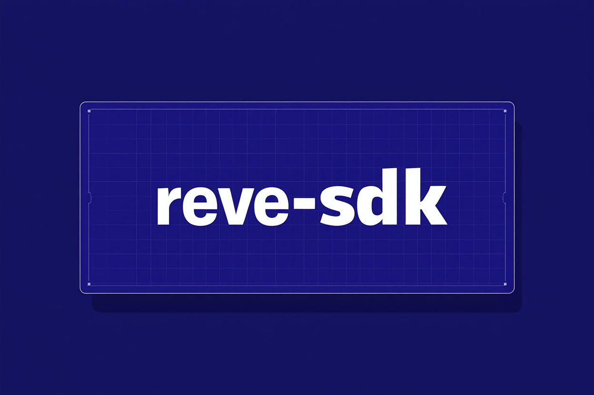

<div align="center">
  
  <p><small><i>Banner generated by Reve AI</i></small></p>
  
  ### An unofficial Node.js SDK for interacting with Reve AI's image generation service

[](https://www.npmjs.com/package/reve-sdk)
[](https://opensource.org/licenses/MIT)
[](https://github.com/flintsh/reve-sdk/stargazers)
[](https://github.com/flintsh/reve-sdk/commits/main)
[](https://www.npmjs.com/package/reve-sdk)
[](https://github.com/flintsh/reve-sdk/issues)
[](https://www.typescriptlang.org/)
[](https://github.com/flintsh/reve-sdk/actions/workflows/quality.yml)

</div>

This SDK provides a programmatic interface for Reve AI's image generation capabilities, allowing developers to integrate Reve's new SOTA model in their applications before they release their own official API/SDKs.

**Note**: This is an unofficial SDK and is not affiliated with or endorsed by Reve AI. Use at your own risk.

## Installation

```bash
npm install reve-sdk
```

## Usage

```typescript
import { ReveAI } from 'reve-sdk';

// Create a new instance of the Reve AI SDK with your authentication
const reveAI = new ReveAI({
  auth: {
    authorization: 'Bearer your-jwt-token-here', // Auth token from browser
    cookie: 'your-cookie-value-here', // Cookie value from browser
  },
  // Optional: specify project ID directly if you know it
  projectId: 'your-project-id-here', // Can be found in network requests of preview.reve.art after /api/project/
  // Optional: enable verbose logging for debugging
  verbose: true, // Set to true to see detailed request/response logs
  // Optional: add custom headers to every request
  customHeaders: { 'x-custom-header': 'value' },
  // Optional configuration
  timeout: 60000, // 60 seconds
  pollingInterval: 2000, // Poll every 2 seconds
  maxPollingAttempts: 60, // Maximum number of polling attempts
});

// Generate an image
async function generateImage() {
  try {
    // Generate an image with a prompt
    const result = await reveAI.generateImage({
      prompt: 'A beautiful landscape with mountains and a lake',
      negativePrompt: 'blur, low quality',
      width: 1024,
      height: 768,
      batchSize: 1, // How many images to generate
      seed: -1, // -1 for random seed
      model: 'text2image_v1/prod/20250325-2246', // Default model
    });
    
    // Access generated image URLs
    console.log('Images generated:', result.imageUrls);
    console.log('Seed used:', result.seed);
    console.log('Completed at:', result.completedAt);
    console.log('Prompt:', result.prompt);
    
    // Save the images to files
    result.imageUrls.forEach((base64Data, index) => {
      // Extract the base64 data (removing the data URL prefix if present)
      const base64Image = base64Data.includes('base64,') 
        ? base64Data.split('base64,')[1] 
        : base64Data;
      
      // Convert base64 to binary
      const imageBuffer = Buffer.from(base64Image, 'base64');
      
      // Save to file
      const fs = require('fs');
      fs.writeFileSync(`image_${index}.webp`, imageBuffer);
    });
    
  } catch (error) {
    console.error('Error generating image:', error);
  }
}

generateImage();
```

## How to get authentication values

To get the authorization token and cookie values:

1. Log in to the Reve AI website (https://preview.reve.art)
2. Open browser developer tools (F12) and go to the Network tab
3. Make an API request on the site (e.g., start a generation)
4. Find the request in the Network tab
5. Copy the "Authorization" header value from the request headers
6. Copy the "Cookie" header value from the request headers
7. Copy the project ID from the request URL (format: `/api/project/{projectId}/generation`)

## Debugging

If you encounter issues with the SDK, you can enable verbose logging by setting the `verbose` option to `true`:

```typescript
const reveAI = new ReveAI({
  // ...other options
  verbose: true
});
```

This will log detailed information about:
- All HTTP requests (URL, method, headers, request body)
- All HTTP responses (status code, headers, response body)
- Detailed error information with request/response context

The verbose mode is particularly helpful for troubleshooting authentication, API endpoint, or project ID issues.

## API Reference

### ReveAI Class

#### Constructor

```typescript
const reveAI = new ReveAI(options);
```

Options:

| Parameter | Type | Required | Default | Description |
|-----------|------|----------|---------|-------------|
| auth | object | Yes | - | Authentication credentials |
| auth.authorization | string | Yes | - | Authorization header with Bearer token |
| auth.cookie | string | Yes | - | Cookie value for authentication |
| projectId | string | No | - | Project ID to use for generations. If not provided, the SDK will try to auto-detect |
| baseUrl | string | No | 'https://preview.reve.art' | Reve AI API base URL |
| timeout | number | No | 30000 | Request timeout in milliseconds |
| maxPollingAttempts | number | No | 60 | Maximum number of status check attempts |
| pollingInterval | number | No | 2000 | Interval between status checks in milliseconds |
| verbose | boolean | No | false | Enable verbose logging for debugging |
| customHeaders | object | No | {} | Custom headers to add to every request |

#### Methods

##### generateImage(options)

Generates an image based on the provided options.

```typescript
const result = await reveAI.generateImage(options);
```

Options:

| Parameter | Type | Required | Default | Description |
|-----------|------|----------|---------|-------------|
| prompt | string | Yes | - | Text prompt describing the image to generate |
| negativePrompt | string | No | '' | Text prompt describing what to exclude from the image |
| width | number | No | 1024 | Image width in pixels (384-1024, divisible by 8) |
| height | number | No | 1024 | Image height in pixels (384-1024, divisible by 8) |
| batchSize | number | No | 1 | Number of images to generate (1-4) |
| seed | number | No | -1 | Random seed (-1 for random) |
| model | string | No | 'text2image_v1/prod/20250325-2246' | Model name to use for generation |

Return value:

```typescript
{
  imageUrls: string[]; // Array of URLs to the generated images
  seed: number; // The seed that was used for generation
  completedAt: Date; // Timestamp when the generation was completed
  prompt: string; // The original prompt
  negativePrompt?: string; // The negative prompt, if provided
}
```

## Error Handling

The SDK throws `ReveAIError` instances for any errors that occur. The error includes a `type` property to help identify the specific error category:

```typescript
try {
  await reveAI.generateImage({ prompt: 'A beautiful sunset' });
} catch (error) {
  if (error.name === 'ReveAIError') {
    console.error(`Error type: ${error.type}`);
    console.error(`Message: ${error.message}`);
    if (error.statusCode) {
      console.error(`Status code: ${error.statusCode}`);
    }
  }
}
```

Error types:
- `AUTHENTICATION_ERROR` - Issues with authentication
- `API_ERROR` - Server returned an error response
- `REQUEST_ERROR` - Network or request formation problems
- `TIMEOUT_ERROR` - Request timed out
- `GENERATION_ERROR` - Image generation failed
- `POLLING_ERROR` - Exceeded maximum polling attempts
- `UNEXPECTED_RESPONSE` - Server response didn't match expected format
- `UNKNOWN_ERROR` - Other unexpected errors

## Development

### Prerequisites

- Node.js (20.x or later)
- npm or yarn

### Setup

1. Clone the repository
2. Install dependencies:
   ```bash
   npm install
   ```
3. Build the project:
   ```bash
   npm run build
   ```

### Testing

Run tests:

```bash
npm test
```

Run tests in watch mode:

```bash
npm run test:watch
```

### Linting and Formatting

Lint the code:

```bash
npm run lint
```

Format the code:

```bash
npm run format
```

## Contributing

Feel free to submit any PRs, here's how to get going:

1. Fork the repository
2. Create your feature branch (`git checkout -b feature/amazing-feature`)
3. Commit your changes (`git commit -m 'Add some amazing feature'`)
4. Push to the branch (`git push origin feature/amazing-feature`)
5. Open a PR

Please make sure your code passes all tests and linting rules before submitting a PR. (thank you)
